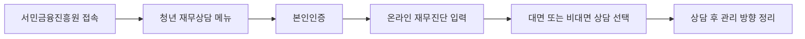

이 글에서는 돈을 바로 주는 지원금이 아니라, 빚·저축·지출 구조를 무료로 점검받는 상담 신청 흐름을 봐야 한다.

**2026년 7월 6일부터** 만 **19~34세 청년**은 `청년 모두를 위한 재무상담`을 신청할 수 있다. 상담 전 과정은 무료다. 내가 확인한 기준으론 지원금처럼 계좌에 돈이 들어오는 제도는 아니지만, 청년미래적금이나 대출을 알아보기 전에 내 지출과 부채를 한 번 정리하는 용도로 꽤 실용적이다.

공식 안내를 읽다가 헷갈렸던 건 이름이다. 재무상담(돈 관리 상태를 보고 저축·대출·지출 방향을 잡아주는 상담)이라 해서 투자 상품 추천을 떠올리기 쉬운데, 핵심은 온라인 재무진단과 1:1 상담이다.

## 누가 신청하면 좋은가

월급은 있는데 매달 잔고가 비는 청년, 청년미래적금·청년도약계좌 납입액을 못 정한 청년, 카드값이나 대출 상환이 부담되는 청년이면 신청해볼 만하다. 지원 대상은 기본적으로 **만 19~34세**다.

## 신청 전 준비할 것

- 본인인증 수단: 간편인증, 휴대폰인증, 공동인증서 중 하나
- 최근 **3개월** 지출 내역
- 대출 잔액과 금리
- 월 고정비: 월세, 통신비, 보험료, 교통비

처음엔 "상담사가 알아서 봐주겠지"라고 생각했는데, 숫자를 안 가져가면 일반적인 얘기만 듣고 끝날 수 있다.

## 신청 흐름

**2026년 7월 3일 기준** 상담 방식은 찾아가는 재무상담, 금융권 재무상담, 1:1 온라인 재무상담, 신용·부채관리 상담 등이다. 지역과 수요에 따라 가능한 방식은 달라질 수 있다.

## 주의할 점

이 상담은 대출 승인이나 적금 가입을 보장하지 않는다. 재무상담을 받았다고 모든 청년 지원금 자격이 생기는 것도 아니다.

개인정보도 조심해야 한다. 신청은 서민금융진흥원 공식 페이지에서 해야 하고, 문자로 온 링크에 카드 비밀번호를 넣으면 안 된다.

짧게 정리하면 이렇다.

- 신청 시작일은 **2026년 7월 6일**이다.
- 대상은 기본적으로 **만 19~34세 청년**이다.
- 상담비는 무료지만, 돈을 직접 지급하는 지원금은 아니다.
- 지출과 대출 정보를 숫자로 준비해야 상담 품질이 올라간다.
- 공식 신청 경로와 본인인증 화면을 확인하고 진행해야 한다.

출처: [서민금융진흥원 청년 모두를 위한 재무상담](https://www.kinfa.or.kr/cyber/youthConsulting/introduce.do), [금융위원회 보도자료 목록](https://www.fsc.go.kr/no010101?srchText=%EC%B2%AD%EB%85%84%EB%AF%B8%EB%9E%98%EC%A0%81%EA%B8%88), [정책브리핑 청년 재무상담 안내](https://www.korea.kr/multi/visualNewsView.do?newsId=148967493&pWise=sub&pWiseSub=C1)
