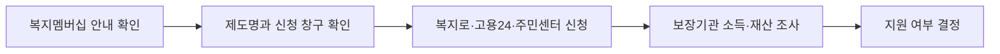

이 그림에서는 알림을 받는 것보다, 실제 신청 전에 소득·재산·가구 정보를 다시 확인해야 한다는 점을 봐야 한다.

**2026년 7월 4일 기준** 복지멤버십 정기안내는 한 번 가입해 둔 사람에게 받을 가능성이 있는 복지서비스를 정부가 다시 찾아 알려주는 제도다. 보건복지부는 **2026년 상반기 처음** 정기안내를 시행했고, 공적자료 판정 결과 **53만 가구, 79만 건**에 카카오톡·전자우편 등으로 안내한다고 밝혔다. 몰랐으면 못 받을 뻔한 생계급여, 차상위계층확인, 국민취업지원제도 같은 항목이 여기서 잡힐 수 있다.

## 왜 새로 봐야 하나

내가 헷갈렸던 건 복지멤버십에 가입하면 계속 자동으로 최신 판정이 되는 줄 알았다는 점이다. 기존에는 나이, 주소, 가구 변화 같은 수시안내는 있었지만 소득·재산 정보는 가입 당시 기준이 남는 경우가 있었다. 그래서 퇴사, 매출 감소, 가족 구성 변화가 생겼는데도 안내를 못 받을 수 있었다.

이번 정기안내는 **연 2회** 최신 소득·재산 정보를 반영해 다시 판단하는 방식이다. 단, 알림은 지원 확정 통보가 아니다. 받을 가능성이 있다는 안내이고, 실제 지급 여부는 신청 뒤 조사에서 결정된다.

| 구분 | 확인할 내용 |
|---|---|
| 대상 | 복지멤버십(맞춤형 급여 안내) 가입자 |
| 반영 정보 | 소득, 재산, 가구, 자격 정보 |
| 안내 방식 | 카카오톡, 전자우편, 복지로 알림 등 |
| 신청 창구 | 복지로, 고용24, 읍면동 행정복지센터 |
| 주의점 | 안내받아도 조사 결과에 따라 탈락 가능 |

## 알림을 받았다면 이렇게 움직인다

안내문에 적힌 제도명부터 확인한다. 예를 들어 생계급여는 복지로 또는 주민센터, 국민취업지원제도는 고용24로 이어질 수 있다. 같은 복지 알림이어도 신청 사이트가 다르다.

서류는 제도마다 다르지만 공통으로 신분증, 통장 사본, 임대차계약서, 소득 확인 자료를 요구받는 일이 많다. 온라인으로 시작해도 보완 요청이 올 수 있으니 문자와 전자우편을 며칠은 확인해야 한다.

## 아직 가입하지 않았다면

복지멤버십은 복지로에서 온라인 신청하거나 가까운 행정복지센터에서 신청할 수 있다. 주소지 주민센터만 고집할 필요는 없지만, 실제 급여 신청 단계에서는 관할 보장기관 안내를 따르는 게 편하다.

체크할 것은 세 가지다.

- 최근 **6개월 안에 퇴사·폐업·소득 감소**가 있었는가
- 독립, 이혼, 출산, 부양가족 변화처럼 **가구 구성**이 바뀌었는가
- 카카오톡이나 전자우편 알림을 놓치지 않게 **연락처**가 최신인가

복지멤버십은 돈을 바로 입금해 주는 제도가 아니다. 그래도 내가 확인한 기준으론 “내가 어떤 제도를 신청할 수 있는지”를 찾는 출발점으로 쓸 만하다. 공식 기준은 보건복지부 2026년 6월 24일 보도자료와 복지로 안내를 기준으로 확인했다.
