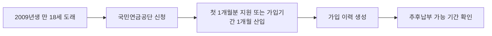

이 그림에서는 돈을 바로 받는 지원금이 아니라, 국민연금 가입 이력을 만드는 신청이라는 점을 봐야 한다.

**2026년 7월 4일 기준** 청년 생애 첫 연금보험료 지원은 **2027년 1월 1일 이후 만 18세가 되는 2009년생부터** 적용된다. 핵심은 간단하다. 국민연금 납부 이력이 없는 청년이 신청하면 생애 첫 **1개월분 연금보험료**를 국가가 지원한다. 내가 처음 봤을 땐 “올해 바로 신청하면 되는 건가?” 싶었는데, 아직은 준비 단계이고 실제 신청은 2027년부터다.

## 누가 대상인가

대상은 나이와 출생연도를 같이 봐야 한다. 보건복지부와 국민연금공단 안내 기준으로는 법 시행일 이후 **18세에 도래하는 청년**, 즉 **2009년생부터** 순차 적용이다. 신청 가능 나이는 **18세부터 26세 사이**다.

| 구분 | 내용 |
|---|---|
| 시행 시점 | **2027년 1월 1일** |
| 첫 적용 | **2009년생** |
| 신청 나이 | **18~26세** |
| 지원 내용 | 기준소득월액(보험료 계산 기준 소득)의 하한액 기준 **1개월분** |
| 신청 창구 | 국민연금공단 지사, 모바일 앱, 홈페이지 |

여기서 헷갈리는 건 “청년이면 다 되는가”다. 아니다. 2008년생처럼 시행일 전에 이미 18세가 된 사람은 현재 공개된 기준만 보면 첫 적용 대상이 아니다. 또 이미 국민연금 보험료를 낸 이력이 있는 18세 청년은 현금성 보험료 지원 대신 **가입기간 1개월 추가 산입** 방식으로 처리된다.

## 금액은 얼마인가

보건복지부는 2027년 기준소득월액 하한액 전망치와 보험료율을 적용해 약 **4만 2천 원 수준**이라고 설명했다. 국민연금공단 FAQ에는 **2027년 1월 기준 하한액 41만 원, 연금보험료 4만 1천 원**이라고 안내되어 있다. 금액이 딱 하나로 보이지 않는 이유는 기준소득월액 하한액과 보험료율이 연도별로 바뀔 수 있기 때문이다.

실제 신청할 때는 “대략 4만 원대”로 생각하되, 최종 금액은 국민연금공단 화면에서 확인하는 게 맞다. 이 제도의 진짜 이득은 당장 몇만 원보다 **납부 이력**이다. 18세에 가입 이력이 생기면 학업이나 군 복무 때문에 못 낸 기간을 나중에 추후납부(나중에 보험료를 내고 가입기간으로 채우는 것)로 연결할 수 있다.

## 신청 전에 볼 것

신청은 국민연금공단 지사 방문, 모바일 앱, 홈페이지 방식으로 안내되어 있다. 아직 2026년 7월 기준으론 실제 신청 화면이 열린 단계가 아니므로, 2009년생이라면 **2027년 생일 전후**에 국민연금공단 공지와 앱 메뉴를 확인하는 식이 현실적이다.

체크할 것은 세 가지다.

- 본인이 **2009년생 이후**인지 확인한다.
- 국민연금 납부 이력이 있는지 앱에서 조회한다.
- 신청 기간을 놓치지 않도록 **18~26세 사이**라는 범위를 기억한다.

주의할 점도 있다. 이건 청년도약계좌처럼 매달 돈이 쌓이는 상품이 아니다. **1개월분 보험료 지원**이고, 이미 납부 이력이 있으면 돈을 받는 방식이 아닐 수 있다. 또 부모가 대신 알아봐도 신청 주체와 본인 확인은 공단 절차를 따라야 한다.

## 짧은 정리

청년 생애 첫 연금보험료 지원은 **2027년부터 2009년생**에게 열리는 국민연금 첫 가입 지원이다. 신청 나이는 **18~26세**, 지원은 **첫 1개월분**이다. 지금 할 일은 신청 버튼을 찾는 게 아니라, 본인 출생연도와 국민연금 납부 이력을 미리 확인하는 것이다.

확인 출처: [보건복지부 보도자료](https://www.mohw.go.kr/board.es?act=view&bid=0027&list_no=1490274&mid=a10503010100), [국민연금공단 FAQ](https://www.nps.or.kr/pnsinfo/ntpsklg/getOHAF0097M0.do), [국민연금공단 2026년 6월 23일 보도자료](https://www.nps.or.kr/pnsgdnc/nscvrgdata/getOHAE0002M1.do?hmpgBbsCd=BS20240145&hmpgCd=01&menuId=MN24000898&pageIndex=1&pstId=ZZ202600000000000702)
