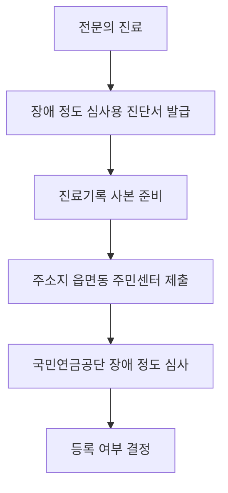

이 글은 병명보다 “장애 등록 기준을 충족하는지”를 우선 봐야 한다는 점을 확인하는 글이다.

**2026년 7월 1일부터 췌장장애도 장애인 등록이 가능하다.** 다만 당뇨병이면 모두 되는 건 아니다. 내가 확인한 기준으론 **6개월 이상 집중적인 인슐린 치료**를 받았고, **C-펩타이드 검사(몸이 인슐린을 얼마나 만들고 있는지 보는 검사)**에서 인슐린 분비 기능이 일정 기준 이하로 확인돼야 한다. 처음엔 “1형 당뇨만 해당하나?” 싶었는데, 보도자료 기준으로는 1형·2형보다 판정 기준 충족 여부가 핵심이다.

## 누가 신청 대상인가

| 확인할 것 | 기준 |
|---|---|
| 시행일 | **2026년 7월 1일** |
| 장애 유형 | 췌장장애, 내부기관 장애에 포함 |
| 치료 이력 | **6개월 이상** 집중적인 인슐린 치료 |
| 검사 기준 | C-펩타이드 검사에서 인슐린 분비 저하 확인 |
| 진단 가능 병원 | 내분비대사내과 또는 소아내분비 전문의가 있는 의료기관 |

여기서 헷갈렸던 건 “혈당이 높다”와 “장애 등록이 된다”가 같은 말이 아니라는 점이다. 혈당 조절이 어렵더라도 진단서에 필요한 검사와 치료 이력이 맞아야 심사로 넘어간다.

## 신청 흐름

신청은 병원에서 끝나는 게 아니다. 의료기관에서 **장애 정도 심사용 진단서**와 **진료기록 사본**을 받은 뒤, 주소지 관할 읍·면·동 주민센터에 내야 한다. 병원을 옮긴 사람도 기존 진료기록을 바탕으로 전문의가 인정하면 진단이 가능하다고 안내됐다.

## 준비서류 체크리스트

- 장애 정도 심사용 진단서
- 최근 진료기록 사본
- C-펩타이드 검사 등 관련 검사 자료
- 신분증
- 입시·취업 우선 심사를 원하면 **고3 재학증명서** 또는 **워크넷 구직등록 확인서**

우선 심사는 **2026년 말까지 한시 운영**된다. 장애인 전형 입시나 취업 일정이 걸려 있다면 주민센터에 접수할 때 이 자료를 같이 내는 게 낫다.

## 받을 수 있는 것과 제한되는 것

등록되면 공공시설 이용료, 전기·통신요금, 공과금 감면, 세제 혜택을 받을 수 있다. 소득과 서비스별 기준을 따로 충족하면 장애인활동지원서비스, 장애수당, 의료비 지원도 연결될 수 있다.

반대로 **장애인연금, 장애인 주차표지, 장애인 콜택시**는 췌장장애 단독 등록만으로는 제한된다. 다른 장애 유형과 중복 등록된 경우에만 가능할 수 있으니, 이 부분은 주민센터에서 별도로 확인해야 한다.

짧게 정리하면, **2026년 7월 4일 기준** 췌장장애 등록은 시작됐지만 “당뇨 진단명”만으로 결정되지 않는다. 6개월 치료 이력, C-펩타이드 검사, 전문의 진단서, 주민센터 접수까지 맞아야 한다. 급하게 필요한 사람은 병원 예약 전에 해당 병원에 장애 진단 가능 전문의가 있는지부터 전화로 확인하는 게 덜 헤맨다.

자료 기준: [보건복지부 2026년 6월 30일 보도자료](https://www.mohw.go.kr/board.es?act=view&bid=0027&list_no=1491055&mid=a10503010100), 장애인복지법 시행령 및 장애 정도 판정 기준 개정 안내.
