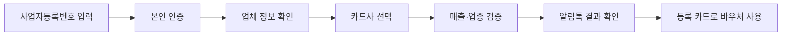

이 지원은 매출이 작은 사업장이 고정비를 줄이는 데 쓰는 바우처라, 신청 전에는 매출 기준과 카드 선택부터 봐야 한다.

2026년 **7월 4일 기준** 소상공인 경영안정 바우처는 **2025년 연매출 0원 초과 1억 4백만 원 미만**이고 신청일 현재 영업 중인 소상공인이 신청할 수 있다. 금액은 사업체당 **25만 원**이다. 처음엔 “전기요금 지원금인가?” 하고 봤는데, 실제 공고를 읽어보니 공과금뿐 아니라 **4대 보험료(국민연금·건강보험·고용보험·산재보험)**, 차량 연료비, 전통시장 화재공제료까지 쓸 수 있는 방식이다.

## 누가 받을 수 있나

공식 공고 기준은 생각보다 딱딱하다. 매출이 적어도 **2025년 12월 31일 이전 개업**이어야 하고, 신청일에 휴업·폐업 상태면 안 된다.

| 구분 | 기준 |
|---|---|
| 매출 | **2025년 연매출 0원 초과 1억 4백만 원 미만** |
| 개업일 | 사업자등록증상 **2025년 12월 31일 이전** |
| 상태 | 신청일 기준 영업 중 |
| 업종 | 소상공인 정책자금 융자 제외 업종은 제외 |
| 중복 | 대표자가 여러 사업체를 가져도 **1곳만** 신청 |

헷갈렸던 건 2025년에 새로 연 사업장이다. 이 경우 실제 매출액을 그대로 보는 게 아니라 월평균 매출을 **12개월로 환산**한다. 예를 들어 2025년 10월 개업 후 매출이 **2,500만 원**이면, 공고 예시 기준으로 3개월로 나눠 12개월을 곱한다. 그래서 **1억 원**으로 계산돼 기준 안에 들어올 수 있다.

## 신청 방법

신청은 전용 누리집인 [소상공인 경영안정 바우처](https://voucher.sbiz24.kr/) 또는 [소상공인24](https://www.sbiz24.kr/)에서 한다. 공식 시행 공고의 신청 기간은 **2026년 2월 9일 09시부터 잠정 2026년 12월 18일 18시까지**다. 다만 예산이 소진되면 조기 마감될 수 있다.

신청할 때 별도 서류를 많이 올리는 방식은 아니다. 소상공인시장진흥공단이 국세청 신고 매출과 개·폐업 정보를 확인한다. 대신 **카드사 선택**은 신중해야 한다. 선정 후 카드사와 카드 유형을 바꾸기 어렵고, 사업주 본인 명의 카드만 등록된다는 점이 걸린다.

## 어디에 쓸 수 있나

- 전기·가스·수도요금 같은 공과금
- 국민연금, 건강보험, 고용보험, 산재보험
- 사업용 차량 연료비
- 소상공인시장진흥공단의 전통시장 화재공제료

사용 방식은 등록한 카드로 결제하면 지정 사용처에서 바우처가 우선 차감되는 구조다. 예를 들어 공과금 **10만 원**을 내면 바우처 잔액은 **15만 원** 남는다. 반대로 음식점 결제처럼 지정 사용처가 아니면 바우처가 빠지지 않고 본인이 부담한다. 사용 기한은 **2026년 12월 31일**까지다.

## 신청 전 확인할 것

가장 위험한 실수는 “매출이 낮으니 당연히 되겠지”라고 보고 카드만 대충 고르는 것이다. 2025년 매출이 **0원**이면 대상이 아니고, 공동대표 사업장은 사업자등록증상의 주대표 1명만 신청할 수 있다. 유흥업, 도박·사행성 업종, 가상자산 매매·중개업처럼 정책자금 제외 업종도 빠진다.

내가 확인한 공식 기준은 중소벤처기업부 공고 제2026-37호와 소상공인 경영안정 바우처 누리집이다. 문의는 전용 콜센터 **1533-0600**, 소상공인시장진흥공단 통합 콜센터 **1533-0100**에서 한다. 받을 수 있는 금액은 크지 않아도, 전기요금이나 4대 보험료처럼 매달 나가는 돈에 바로 붙일 수 있다는 점이 실용적이다.
