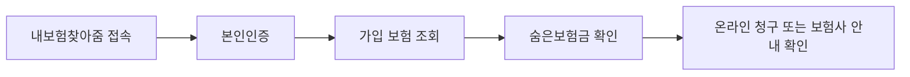

이 그림에서는 보험증권을 찾기 전에 휴대폰 본인인증으로 조회부터 할 수 있다는 점을 보면 된다.

2026년 **7월 7일 기준** 숨은보험금은 `내보험찾아줌`에서 조회하고 바로 청구할 수 있다. 금융위원회 발표에 따르면 올해 안내 대상 숨은보험금 규모는 **10조 3000억 원**이고, 지난해에는 **3조 2470억 원**이 환급됐다. 몰랐으면 그냥 지나갈 돈이라, 보험을 오래 들었거나 부모님 보험을 대신 챙기는 사람은 한 번 확인하는 게 낫다.

## 숨은보험금이 뭔가

숨은보험금은 보험금 지급금액이 확정됐는데 아직 청구하지 않은 돈이다. 쉽게 말해 보험사가 줄 돈이 있는데 가입자나 수익자가 모르고 있는 상태다. 만기보험금, 휴면보험금, 중도보험금처럼 이름은 다르지만 핵심은 같다. 내가 신청해야 돈이 나온다.

| 확인할 항목 | 기준 |
|---|---|
| 발표일 | **2026년 7월 7일** |
| 조회 사이트 | `내보험찾아줌` 누리집 |
| 가능한 일 | 보험계약 조회, 숨은보험금 조회·청구, 피상속인 보험계약 확인 |
| 올해 안내 방식 | 우편, 모바일 전자고지, 유선 안내 |
| 공식 출처 | 금융위원회·정책브리핑 |

## 조회와 청구 순서

처음엔 보험사 앱을 하나씩 들어가야 하나 생각했는데, 실제로는 통합 조회부터 하는 방식이다. PC나 휴대폰에서 `내보험찾아줌`에 접속한 뒤 본인인증을 한다. 조회 결과에 미청구 보험금이 나오면 해당 건을 선택해 청구한다.

공식 접속 주소는 **https://cont.insure.or.kr/** 또는 **https://cont.knia.or.kr/** 이다. 검색 광고를 눌렀다가 비슷한 이름의 민간 사이트로 들어가는 실수를 하기 쉽다. 주소창을 직접 확인하는 편이 낫다.

## 이런 사람은 특히 확인한다

- 예전에 가입한 저축성 보험이나 자녀보험을 해지하지 않고 둔 사람
- 부모님이 가입한 보험 내역을 가족이 대신 정리해야 하는 경우
- 이사 뒤 주소 변경을 보험사에 알리지 않은 사람
- 만기 안내 문자나 우편을 놓친 적이 있는 사람

내가 확인한 기준으론 고령층은 비대면 조회가 어려워 안내를 받아도 청구까지 못 가는 경우가 생긴다. 가족이 도와줄 때도 본인 인증과 계좌 입력은 당사자 동의 아래 진행해야 한다.

## 주의할 점

숨은보험금 안내를 빌미로 신분증 사진, 카드번호, 원격제어 앱 설치를 요구하면 멈춰야 한다. 공식 조회는 본인인증으로 진행하고, 수수료 선납을 요구하지 않는다. 전화 안내를 받았더라도 바로 계좌를 말하지 말고 `내보험찾아줌`에서 직접 조회하는 게 안전하다.

핵심은 세 가지다. **2026년 7월부터 집중 안내가 시작됐다.** 조회는 `내보험찾아줌`에서 한다. 청구 전에는 사이트 주소와 본인 명의 계좌를 다시 확인한다.

자료 출처: [대한민국 정책브리핑, 2026년 7월 7일 금융위원회 발표](https://www.korea.kr/news/policyNewsView.do?newsId=148967724&pWise=main&pWiseMain=L1)
