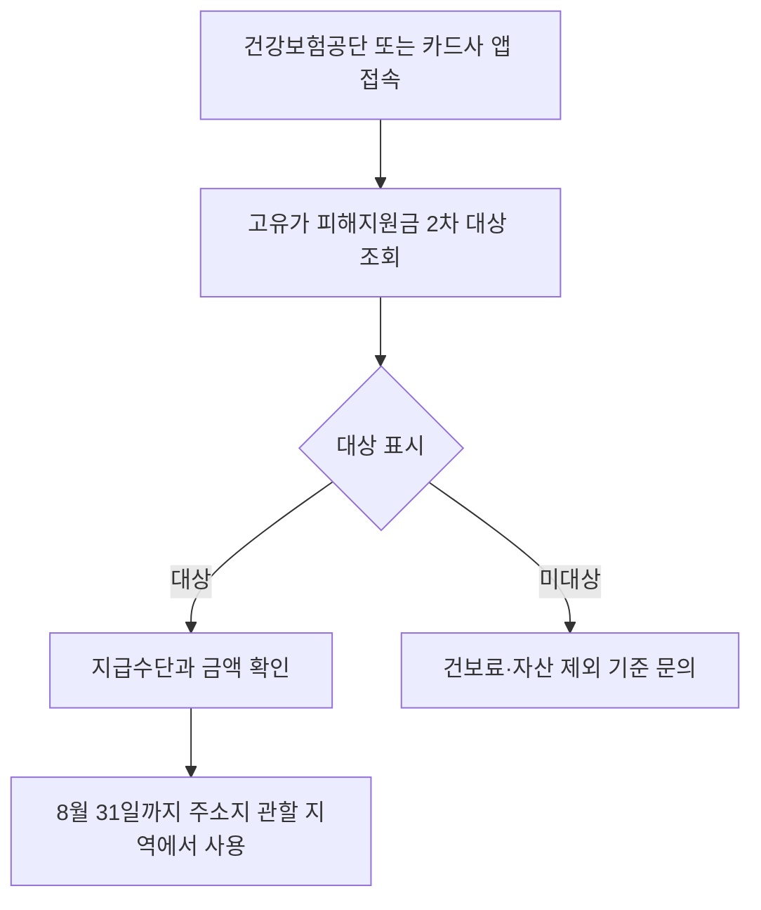

이 그림에서는 신청 버튼보다 **대상 여부·지급수단·사용기한** 확인이 더 급하다는 점을 보면 된다.

**2026년 7월 8일 기준으로 고유가 피해지원금 2차 신청은 끝났다.** 신청 기간은 행정안전부 안내 기준 **2026년 5월 18일 오전 9시부터 7월 3일 오후 6시까지**였다. 지금 할 일은 새로 신청하는 게 아니라, 내가 신청했는지, 지급대상으로 잡혔는지, 받은 금액을 **8월 31일** 안에 쓸 수 있는지 확인하는 것이다.

공식 안내를 읽다가 헷갈렸던 건 “조회”와 “신청”이 같은 화면에 붙어 있다는 점이었다. 건강보험공단 홈페이지에는 7월 8일 현재도 **고유가 피해지원금 2차 지급대상 여부 조회** 입구가 보인다. 다만 조회가 된다고 해서 마감 뒤 신규 신청이 자동으로 열리는 건 아니다.

## 누가 2차 대상이었나

2차 지급은 취약계층 1차 지급 뒤, 건강보험료 기준으로 선별한 **국민 70%** 대상이었다. 행정안전부 기준 지원금은 지역과 자격에 따라 달랐다.

| 구분 | 수도권 | 비수도권 | 인구감소 우대지원지역 | 특별지원지역 |
|---|---:|---:|---:|---:|
| 소득하위 70% | **10만원** | **15만원** | **20만원** | **25만원** |
| 차상위·한부모 | **45만원** | **50만원** | 지역 기준 확인 | 지역 기준 확인 |
| 기초생활수급자 | **55만원** | **60만원** | 지역 기준 확인 | 지역 기준 확인 |

여기서 소득하위 70%는 단순 월급이 아니라 건강보험료로 판단한다. 또 고액 자산가는 빠질 수 있다. 재산세 과세표준, 금융소득 같은 항목은 건강보험공단보다 관할 지자체 세무부서나 세무서 확인이 더 빠르다.

## 지금 확인할 순서

온라인은 국민건강보험공단, 카드사 앱·홈페이지, 지역사랑상품권 앱에서 확인한다. 오프라인은 읍면동 행정복지센터(주민센터)나 카드 연계 은행 영업점에서 묻는 방식이다. 전화로 물을 때는 “고유가 피해지원금 신청하고 싶다”보다 **“2차 지급대상 조회 결과와 지급수단을 확인하고 싶다”**고 말해야 설명이 덜 꼬인다.

## 신청 마감 뒤 주의할 점

마감일 이후 가장 위험한 건 문자 링크다. 지원금 조회를 이유로 URL을 누르게 하는 문자는 피하는 게 낫다. 직접 앱을 열거나 주소를 검색해서 들어가는 방식이 안전하다.

또 하나는 사용기한이다. 2차 지원금은 받은 뒤 아무 때나 쓰는 돈이 아니다. 공식 안내 기준 사용기한은 **2026년 8월 31일**까지다. 지역사랑상품권이나 카드 포인트처럼 지급수단에 따라 사용처가 제한될 수 있으니, 편의점·주유소·대형마트 사용 가능 여부를 앱에서 확인해야 한다.

내가 확인한 기준으론 지금 필요한 건 세 가지다. **대상 여부**, **실제 지급금액**, **8월 31일 전 사용 가능 가맹점**이다. 신청 기간을 놓쳤다면 카드사 앱만 반복해서 누르기보다 주민센터에 마감 후 처리 가능한 예외가 있는지 묻는 편이 빠르다.

출처: [행정안전부 고유가 피해지원금 안내](https://www.mois.go.kr/frt/sub/a06/b07/highOilPriceSupport/screen.do), [행정안전부 2차 지급 보도자료](https://www.mois.go.kr/frt/bbs/type010/commonSelectBoardArticle.do?bbsId=BBSMSTR_000000000008&nttId=125906), [국민건강보험공단](https://www.nhis.or.kr/)
