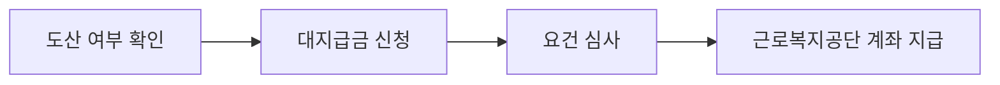

이 그림에서는 체불임금 대지급금 신청 전에 급여명세서, 퇴직일, 회사 도산 여부를 같이 확인해야 한다는 점을 보면 된다.

**2026년 8월 20일부터** 회사가 도산한 경우 체불임금 대지급금(사업주가 못 준 임금 일부를 국가가 대신 지급하는 제도)의 임금 보호 범위가 **최종 3개월분에서 최종 6개월분**으로 늘어난다. 월급이 두세 달 밀렸을 때는 버티면 되겠지 싶지만, 회사가 파산 절차에 들어가면 말이 달라진다. 내가 확인한 기준으론 신청 전에 `도산`이 인정되는지가 제일 큰 갈림길이다.

## 누가 대상인가

고용노동부의 2026년 하반기 제도 안내 기준이다. 단순히 월급이 밀렸다는 이유만으로 바로 받는 제도는 아니다.

| 확인할 조건 | 기준 |
|---|---|
| 사업장 상태 | 재판상 도산(법원 파산선고·회생절차개시) 또는 사실상 도산(지방고용노동관서의 도산등사실인정) |
| 근로자 상태 | 임금·퇴직급여 등을 받지 못하고 퇴직한 근로자 |
| 퇴직 시점 | 퇴직기준일의 **1년 전부터 3년 이내** 퇴직 |
| 지급 범위 | 최종 **6개월분** 임금·휴업수당·출산전후휴가기간 급여, 최종 **3년분** 퇴직급여 |
| 한도 | 항목별·연령대별 상한액 적용, 실제 체불액 전부가 아닐 수 있음 |

여기서 헷갈렸던 건 `6개월분`이라는 말이다. 무조건 6개월치 월급을 다 받는다는 뜻이 아니다. 체불된 임금 중 법에서 정한 범위와 상한 안에서 지급된다. 예를 들어 마지막 8개월 동안 임금이 밀렸다면 확대 뒤에도 임금 부분은 최종 6개월분까지만 본다.

## 신청 흐름

공식 안내의 신청 순서는 크게 세 단계다.

실제로는 첫 단계가 가장 오래 걸릴 수 있다. 법원의 파산선고나 회생절차개시결정이 이미 있으면 그 자료를 확인한다. 그게 아니라면 지방고용노동관서에 도산등사실인정(회사가 사실상 임금을 줄 능력이 없다고 인정받는 절차)을 신청해야 한다.

신청은 온라인 노동포털 `labor.moel.go.kr` 또는 지방고용노동관서 방문으로 진행한다. 준비할 것은 보통 신분증, 통장 사본, 근로관계와 체불액을 보여주는 자료다. 근로계약서, 급여명세서, 임금 입금 내역, 퇴직확인 자료가 흩어져 있으면 접수할 때 다시 찾느라 시간이 밀린다.

## 주의할 점

**2026년 7월 8일 기준** 시행일은 아직 오지 않았다. 확대 적용은 **2026년 8월 20일**부터다. 그 전에 신청하는 사건은 적용 기준을 고용노동부 상담센터 **1350**이나 근로복지공단 **1588-0075**에 확인하는 편이 낫다.

또 하나는 퇴직일 계산이다. 퇴직기준일에서 벗어나면 체불액이 있어도 도산대지급금 대상에서 빠질 수 있다. 회사가 연락을 피한다고 기다리기만 하면 손해다. 최소한 퇴직일, 마지막 임금 지급일, 체불 개월 수는 메모해두는 게 좋다.

## 짧은 정리

- **2026년 8월 20일**부터 도산 사업장 체불임금 보호 범위가 최종 **6개월분**으로 확대된다.
- 대상은 도산한 사업장에서 임금·퇴직급여를 못 받고 퇴직한 근로자다.
- 법원 도산 자료가 없으면 지방고용노동관서의 도산등사실인정이 필요할 수 있다.
- 신청은 `labor.moel.go.kr` 또는 지방고용노동관서에서 한다.
- 출처: [2026년 하반기부터 이렇게 달라집니다 - 고용노동부](https://whatsnew.mofe.go.kr/mec/ots/dif/view.do?comBaseCd=DIFGODEPRT&difGovDepart1=DIFGODR011&difSer=506cf949-d8e1-4532-b8bf-d114370d0e08&temp=2026&temp2=HALF002)
