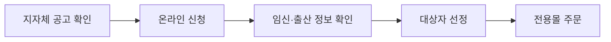

이 그림에서는 임산부 친환경농산물 꾸러미가 현금 지급이 아니라 지정 쇼핑몰에서 먹거리를 고르는 방식이라는 점을 보면 된다.

**2026년 7월 8일 기준** 임산부 친환경농산물 꾸러미는 전국 임산부 **16만 명**에게 **24만 원 상당**의 친환경 농산물 구매 기회를 주는 지원이다. 본인부담금은 **4만8천 원**이고, 나머지 **19만2천 원**은 지원 포인트처럼 쓰는 방식이다. 내가 처음 헷갈렸던 건 `지원금`처럼 계좌로 돈이 들어오는 줄 알았다는 점이다. 실제로는 선정된 사람이 전용 온라인몰에서 농산물 꾸러미를 주문하고, 주문액의 일부를 결제한다.

## 누가 신청할 수 있나

농림축산식품부 안내 기준으론 사업 대상은 신청일 현재 임신부이거나 **2025년 1월 1일 이후 출산한 산모**다. 소득 기준은 별도로 두지 않는다고 안내됐지만, 지자체별 예산과 모집 공고에 따라 접수 기간, 선정 인원, 세부 운영 방식이 달라질 수 있다. 같은 2026년이어도 서울, 경기, 전남처럼 거주지별 공고를 따로 봐야 한다.

| 확인할 조건 | 봐야 할 기준 |
|---|---|
| 임신 상태 | 임신확인서 등으로 임신 사실 확인 가능 |
| 출산 후 신청 | **2025년 1월 1일 이후** 출산한 산모인지 확인 |
| 거주지 | 주민등록상 주소지 지자체 사업 참여 여부 |
| 중복 여부 | 영양플러스, 농식품바우처 등 제외 사업 해당 여부 확인 |
| 신청 기간 | 지자체 공고별 접수 시작일과 마감일 확인 |

여기서 `임산부`는 임신부와 산모를 같이 부르는 말이다. `친환경농산물 꾸러미`는 채소, 과일, 축산물, 수산물, 가공식품 등을 전용몰에서 골라 받는 장보기 지원에 가깝다. 올해 필수 공급 품목은 기존 시범사업 때보다 늘어난 **55개 품목**으로 안내됐다.

## 신청 방법

신청은 보통 임산부 친환경농산물 쇼핑몰 또는 주소지 지자체 안내 페이지에서 진행한다. 일부 지역은 에코이몰 같은 통합 쇼핑몰 접수와 읍·면·동 행정복지센터 방문 접수를 같이 받는다.

준비할 것은 많지 않지만, 빠뜨리면 접수가 밀린다. 임신 중이면 임신확인서, 출산 후라면 출생증명 또는 주민등록 정보로 확인하는 경우가 많다. 행정정보 공동이용(기관끼리 주민등록 등 필요한 정보를 확인하는 절차)에 동의하면 서류 제출이 줄 수 있다.

## 신청 전에 볼 것

가장 중요한 건 모집 방식이다. 선착순이면 공고 당일에 마감될 수 있고, 추첨이면 빨리 신청해도 선정이 확정되지 않는다. 또 **24만 원 상당**이라고 해도 전액 무료는 아니다. 본인부담금 **4만8천 원**이 들어간다. 이 부분을 놓치면 "왜 돈을 내야 하지" 하고 당황한다.

- 주소지 지자체가 **2026년 사업을 운영하는지** 확인한다.
- 신청 기간과 선정 방식이 **선착순인지 추첨인지** 본다.
- 본인 부담금, 주문 가능 횟수, 배송비 조건을 확인한다.
- 선정 뒤 정해진 기간 안에 주문하지 않으면 지원 자격이 멈출 수 있다.
- 이사하면 기존 주소지 지원을 계속 쓸 수 있는지 지자체에 확인해야 한다.

## 짧은 정리

임산부 친환경농산물 꾸러미는 현금성 출산지원금이 아니라 장보기 비용을 줄이는 생활 지원이다. **임신 중이거나 2025년 1월 1일 이후 출산한 산모**라면 주소지 지자체 공고부터 확인하면 된다. 신청 전에는 모집 기간, 선정 방식, 본인 부담금, 전용몰 사용기한 네 가지를 봐야 한다.

출처: [농식품부, 임산부 친환경 농산물 꾸러미 지원 - 연합뉴스](https://www.yna.co.kr/amp/view/AKR20260708072100030), [2026년 임산부 친환경농산물 꾸러미 사업 준비 - 정책브리핑 PDF](https://www.korea.kr/common/download.do?fileId=198390784&tblKey=GMN)
