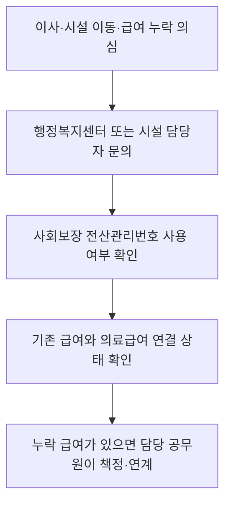

이 그림에서는 복지 급여가 주소 이전 뒤에도 같은 기록으로 이어지는지를 봐야 한다.

**2026년 7월 9일 기준** 주민등록번호를 바로 쓰기 어려운 사람은 사회보장 전산관리번호부터 확인해야 한다. 이 번호가 개편되면서 이사하거나 시설을 옮겨도 기존 복지서비스가 끊기지 않도록 바뀌었다. 몰랐으면 “주소가 바뀌었으니 다시 신청해야 하나?” 하고 헤맬 수 있는 부분이다.

사회보장 전산관리번호는 주민등록번호가 없거나 확인이 어려운 사람에게 복지 행정용으로 부여하는 번호다. 예를 들면 주민등록 불명자, 행려환자(보호자가 없거나 신원 확인이 어려운 환자), 개인정보 보호시설 입소자처럼 일반적인 본인확인이 어려운 경우가 해당된다.

## 뭐가 달라졌나

예전 번호에는 지역이나 시설을 짐작할 수 있는 정보가 들어갈 수 있었다. 그래서 A 지역 시설에서 B 지역 시설로 옮기면 번호 관리가 꼬이거나, 전산망끼리 호환이 안 되는 문제가 있었다. 이번 개편은 이 부분을 줄이는 데 초점이 있다.

| 구분 | 2026년 7월 9일 개편 내용 |
|---|---|
| 번호 체계 | 지역·시설 기호 삭제 |
| 이동 처리 | 이사·시설 이동 뒤에도 같은 번호 계속 사용 |
| 개인정보 | 번호만 보고 지역·시설이 드러나는 위험 완화 |
| 급여 확인 | 아동수당·부모급여 같은 보편급여 누락 알림 강화 |
| 의료 이용 | 의료급여 대상자의 진료 접수 불편 개선 추진 |

여기서 핵심은 “새 돈을 주는 제도”가 아니라 “받아야 할 급여가 빠지지 않게 연결하는 장치”라는 점이다. 특히 아동수당, 부모급여처럼 나이 기준으로 자동 확인돼야 하는 급여는 담당 공무원에게 시스템 알림이 가도록 바뀐다.

## 누가 확인해야 하나

본인이 주민등록번호로 복지서비스를 받고 있다면 크게 신경 쓸 일은 적다. 다만 가족이나 보호 중인 사람이 아래 상황이면 행정복지센터에 확인하는 게 낫다.

- 시설 입소 또는 퇴소가 있었던 사람
- 주소지를 옮겼는데 복지급여 입금이나 통지가 늦어진 사람
- 의료급여(병원비를 국가가 지원하는 제도) 대상인데 병원 접수에서 번호 확인이 자주 막힌 사람
- 아동수당·부모급여 대상 나이인데 실제 지급 여부가 애매한 아동
- 주민등록이 불명확해 임시 번호로 복지서비스를 받는 사람

## 확인 절차

복지로에서 바로 해결되는 신청형 제도와 다르게, 전산관리번호는 현장 확인이 중요하다. 내가 확인한 기준으론 온라인 검색보다 주소지 행정복지센터나 시설 담당자에게 묻는 편이 빠르다.

문의할 때는 “사회보장 전산관리번호가 개편됐는데, 기존 복지급여와 의료급여가 이어져 있는지 확인하고 싶다”고 말하면 된다. 서류는 상황마다 다르지만 신분을 확인할 수 있는 자료, 시설 입·퇴소 확인, 보호자 연락처, 기존 급여 통지서가 있으면 설명이 쉬워진다.

## 헷갈리기 쉬운 점

이 번호가 있다고 모든 급여가 자동 지급되는 건 아니다. 생계급여, 의료급여, 주거급여처럼 소득·재산 조사가 필요한 제도는 여전히 자격 심사를 거친다. 다만 이미 받을 수 있는 보편급여나 기존 수급 기록이 이동 과정에서 끊기는 일을 줄이는 쪽에 가깝다.

또 하나는 “시설에서 나왔으니 번호도 끝났다”고 생각하는 경우다. 보건복지부는 급여 지급이나 입소 기록이 없는 의심 번호를 자동 종료하는 관리도 강화한다고 밝혔다. 실제로 계속 지원이 필요한 상태라면 퇴소·이사 직후에 연락처와 거주지를 업데이트해야 한다.

짧게 잡으면 이렇다. **2026년 7월 9일부터** 사회보장 전산관리번호는 이사나 시설 이동 뒤에도 복지서비스가 이어지도록 개편됐다. 주민등록번호 확인이 어려운 가족, 보호 아동, 시설 입소자가 있다면 “급여가 들어오겠지” 하고 기다리지 말고 행정복지센터에 번호와 급여 연결 상태를 확인하는 게 안전하다.

출처: [보건복지부 보도자료 - 사회보장 전산관리번호 7월 9일 개편·시행](https://www.mohw.go.kr/board.es?act=view&bid=0027&list_no=1491193&mid=a10503010200&nPage=1&tag=)
