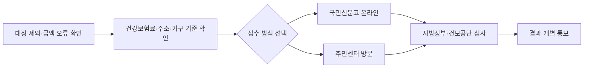

이의신청은 지원 대상에서 빠진 이유와 금액 산정 기준을 숫자로 확인하는 절차다. 건강보험료, 재산세 과세표준, 금융소득 중 어디서 막혔는지부터 봐야 한다.

**2026년 7월 9일 기준**, 고유가 피해지원금 2차 신청은 이미 **7월 3일 18시**에 끝났다. 그래도 대상자 선정 결과나 지원 금액이 이상하면 아직 끝난 게 아니다. 행정안전부 안내 기준 이의신청 접수는 **2026년 7월 17일 금요일까지** 가능하다.

처음엔 "신청 기간이 끝났으니 못 받겠구나"라고 생각하기 쉽다. 나도 공고를 읽다가 여기서 헷갈렸다. 신청 마감과 이의신청 마감은 날짜가 다르다. 대상 제외 문자를 받았거나, 수도권·비수도권·인구감소지역 금액이 다르게 나온 경우엔 바로 확인해야 한다.

## 누가 이의신청을 봐야 하나

| 확인 상황 | 볼 기준 | 준비할 것 |
|---|---|---|
| 대상 제외로 나옴 | 건강보험료 기준, 고액자산가 제외 기준 | 건강보험료 납부 내역, 소득 변동 자료 |
| 금액이 예상보다 적음 | 주소지와 지역 구분 | 주민등록상 주소, 지급 안내 문자 |
| 가족 수가 다르게 보임 | 가구 구성 기준 | 주민등록등본, 가족관계증명서 |
| 최근 소득이 줄었음 | 건강보험료 조정 가능 여부 | 퇴사·폐업·소득감소 증빙 |

고유가 피해지원금은 소득과 지역을 같이 본다. 행안부 안내 기준 지원 금액은 소득하위 70% 일반 대상자는 **수도권 10만원**, **비수도권 15만원**, 인구감소지역은 **20만원 또는 25만원**이다. 기초생활수급자와 차상위·한부모 가구는 별도 금액이 적용돼 더 크다.

## 신청 경로는 두 가지다

온라인은 **국민신문고(epeople.go.kr)**에서 이의신청을 넣는다. 온라인 마감은 **7월 17일 18시**다. 오프라인은 주소지 읍면동 행정복지센터(주민센터, 읍·면사무소)에 가야 하는데, 제헌절 때문에 **7월 16일 18시**까지로 보는 게 안전하다. 접수된 건은 지방정부와 국민건강보험공단 심사를 거쳐 문자나 메일로 통보된다.

이 흐름에서 중요한 건 "왜 틀렸다고 보는지"를 짧게 쓰는 것이다. 예를 들어 "2026년 5월 퇴사로 소득이 줄었는데 직전 건강보험료 기준으로 제외됐다"처럼 날짜와 사유를 붙인다. 그냥 억울하다고 쓰면 담당자가 확인할 기준이 흐려진다.

## 확인할 사이트와 전화번호

건강보험료는 국민건강보험공단 누리집·앱에서 본다. 소득 감소로 건강보험료 조정이 필요한 경우엔 공단 고객센터 **1577-1000**에 물어보는 게 빠르다. 재산세 과세표준은 위택스, 금융소득은 홈택스에서 확인한다. 고유가 피해지원금 전담 콜센터는 **1670-2626**, 일반 정부 민원 안내는 **110**이다.

주의할 점도 있다. 이의신청은 새로 신청하는 절차가 아니다. **7월 3일까지 신청 자체를 하지 않은 일반 대상자**라면 구제 범위가 달라질 수 있다. 반대로 신청했는데 대상 제외, 금액 오류, 가구 기준 오류가 의심되는 경우라면 **7월 17일 전**에 근거 자료를 붙여 접수하는 쪽이 맞다.

짧게 정리하면 이렇다.

- 신청 마감: **2026년 7월 3일 18시**
- 온라인 이의신청 마감: **2026년 7월 17일 18시**
- 방문 이의신청 마감: **2026년 7월 16일 18시**
- 온라인 접수: **국민신문고**
- 방문 접수: **주소지 읍면동 행정복지센터**
- 확인 기준: 건강보험료, 주소지, 가구 구성, 재산세 과세표준, 금융소득

공식 안내는 행정안전부 고유가 피해지원금 안내와 2026년 5월 17일 보도자료에서 확인할 수 있다.

- [행정안전부 고유가 피해지원금 안내](https://www.mois.go.kr/frt/sub/a06/b07/highOilPriceSupport/screen.do)
- [행정안전부 보도자료 - 고유가 피해지원금 2차 지급 신청](https://www.mois.go.kr/frt/bbs/type010/commonSelectBoardArticle.do?bbsId=BBSMSTR_000000000008&nttId=126074)
- [국민신문고 고유가 피해지원금 지급 이의신청](https://www.epeople.go.kr/nsf/Intro.html)
