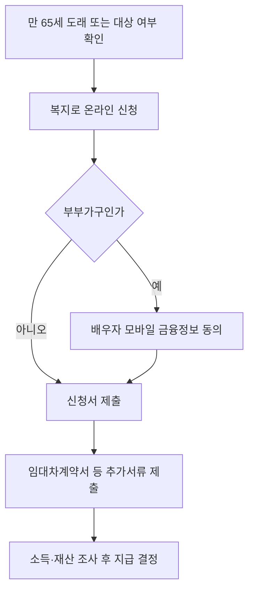

이 그림에서는 종이 서류보다 온라인 신청 흐름부터 잡는 게 핵심이다.

**2026년 7월 9일 보건복지부 발표 기준**, 기초연금 온라인 신청은 **2026년 10월부터** 덜 막히게 바뀐다. 부부가 따로 있어도 배우자 금융정보 제공 동의(소득·재산 확인을 위한 동의)를 모바일 메시지로 처리할 수 있고, 임대차계약서 같은 추가서류는 신청 완료 뒤 온라인이나 방문으로 낼 수 있다.

헷갈렸던 지점은 “온라인 신청 가능”과 “온라인으로 끝까지 쉽다”가 다르다는 점이었다. 2025년 기초연금 신청자 **887,431명** 중 온라인 신청은 **29,903명**, **3.4%**뿐이었다. 중간 저장이 많이 생긴 단계도 금융정보 동의와 구비서류 작성이었다.

| 구분 | 2026년 10월 개선 전후 |
|---|---|
| 배우자 동의 | 같은 자리에서 처리하거나 나중에 다시 등록해야 해 막히기 쉬웠다 |
| 개선 후 | 배우자에게 모바일 메시지를 보내 금융정보 제공 동의를 받을 수 있다 |
| 추가서류 | 신청 중 파일을 등록해야 신청 완료가 되는 경우가 있었다 |
| 개선 후 | 온라인 신청 완료 뒤 온라인 또는 방문으로 추후 제출할 수 있다 |
| 수급희망 이력관리 | 별도 신청서 작성 부담이 있었다 |
| 개선 후 | 신청 동의 클릭 방식으로 간단해진다 |

기초연금은 만 **65세 이상** 중 소득인정액(소득과 재산을 월 소득처럼 환산한 금액)이 기준 이하일 때 받을 수 있다. **2026년 선정기준액은 단독가구 월 247만 원, 부부가구 월 395만 2천 원**으로 알려져 있다. 국민연금 수급액, 부부 동시 수급 여부에 따라 실제 금액은 줄 수 있다.

신청 흐름은 이렇게 잡으면 덜 헤맨다.

준비물은 간편인증, 본인 명의 계좌, 임대차계약서가 있으면 그 사본이다. 사실혼·이혼 관계, 전월세 보증금, 부채가 얽힌 경우엔 서류가 더 붙을 수 있다. 여기서 내가 착각한 건 “추후 제출”이 “서류 없이 심사 완료”라는 뜻이라고 본 점이다. 아니다. 서류를 늦게 내면 결정도 늦어진다.

주의할 점도 있다. **2026년 10월 전까지는 기존 온라인 절차가 적용**될 수 있다. 부모님 신청을 도와드릴 때는 배우자 휴대전화가 본인 인증을 받을 수 있는 상태인지 확인해야 한다. 동의 메시지를 못 받으면 그 단계에서 다시 멈춘다.

출처는 [보건복지부 **2026년 7월 9일** 보도자료](https://www.mohw.go.kr/board.es?act=view&bid=0027&list_no=1491209&mid=a10503000000)와 기초연금 안내 기준이다. 신청은 복지로 또는 주소지 행정복지센터에서 한다. 온라인으로 시작했다면 추가서류 제출 여부를 신청 후 바로 확인해야 한다.

짧게 정리하면 이렇다.

- **2026년 10월부터** 기초연금 온라인 신청 절차가 간소화된다.
- 부부가구는 배우자 금융정보 동의를 모바일 메시지로 처리할 수 있다.
- 추가서류는 신청 완료 후 제출 방식이 추가되지만, 늦게 내면 결정도 늦어진다.
- **만 65세 이상**이어도 소득·재산 조사 결과에 따라 탈락하거나 감액될 수 있다.
