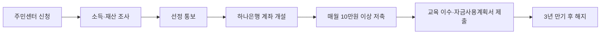

이 글에서는 7월 모집 일정, 월 저축액, 주민센터 방문 전 확인할 서류를 봐야 한다.

**2026년 7월 9일 기준** 희망저축계좌Ⅱ는 일하는 주거·교육급여 수급가구나 차상위계층이 **3년** 동안 매달 저축하면 정부지원금이 붙는 자산형성 통장이다. 공식 자산형성지원 지침상 2차 신규 모집은 **2026년 7월 1일~7월 27일**로 잡혀 있다. 다만 내가 확인한 일부 지자체 안내에는 2차 모집을 “중단”으로 표시한 곳도 있었다. 그래서 이 글의 핵심은 하나다. 신청 대상이면 바로 서류를 들고 가기보다, 주소지 행정복지센터에 “희망저축계좌Ⅱ 7월 모집 접수 중인지”를 전화로 확인해야 한다.

## 누가 신청할 수 있나

복지로와 2026년 자산형성지원 통장사업 안내 기준으로 보면, 희망저축계좌Ⅱ는 소득이 전혀 없는 가구가 아니라 **현재 근로·사업소득이 있는 가구**가 대상이다. “차상위계층”은 기준 중위소득의 일정 비율 이하로 생활이 어려운 계층을 말한다.

| 구분 | 확인할 내용 |
|---|---|
| 가구 조건 | 주거급여·교육급여 수급가구 또는 차상위계층 |
| 소득 기준 | 가구 소득인정액이 **기준 중위소득 50% 이하** |
| 근로 조건 | 재직, 사업, 일용근로 등 실제 근로·사업소득 필요 |
| 신청 위치 | 주소지 읍·면·동 행정복지센터 방문 |
| 중복 주의 | 희망키움통장Ⅱ 등 유사 자산형성사업 참여 이력 확인 |

여기서 헷갈렸던 건 “소득이 낮으면 무조건 된다”가 아니라는 점이다. 급여명세서, 급여이체내역, 사업자등록증, 근로활동 및 소득신고서처럼 일을 하고 있다는 자료가 필요할 수 있다.

## 돈은 어떻게 붙나

2025년 이후 가입자는 본인이 매월 **10만 원 이상** 저축하면 정부의 근로소득장려금(일해서 생긴 소득을 유지할 때 붙는 지원금)이 가입 연차별로 붙는다. 1년차 **월 10만 원**, 2년차 **월 20만 원**, 3년차 **월 30만 원** 방식이다. 본인은 최소 10만 원을 넣지만, 3년을 채우면 정부지원금 차이가 커진다.

## 신청 전 체크할 것

- **7월 모집 여부:** 지침상 일정은 **7월 1일~7월 27일**이지만 지자체별 예산·운영 사정으로 달라질 수 있다.
- **월 납입일:** 매월 **22일**을 넘겨 넣으면 그달 정부지원금이 안 붙을 수 있다.
- **미납 위험:** 본인적립금을 누적 **12개월** 미납하면 환수해지(정부지원금 없이 본인 저축액 중심으로 해지)될 수 있다.
- **압류 위험:** 자산형성지원 통장은 압류방지 통장이 아니다. 기존 채무 문제가 있으면 주민센터에 미리 말하는 게 낫다.
- **서류:** 신분증, 근로확인서류, 소득자료, 통장 관련 안내를 준비한다. 지자체마다 추가 서류가 있을 수 있다.

짧게 정리하면, 희망저축계좌Ⅱ는 “저소득 가구라서 받는 지원금”이라기보다 **일을 유지하면서 3년 저축할 수 있는지**를 보는 통장이다. 오늘 기준으로 우선 할 일은 복지로 검색보다 주소지 행정복지센터 전화다. “7월 희망저축계좌Ⅱ 접수 중인지, 근로소득 증빙은 무엇을 가져가야 하는지” 두 가지만 물어보면 헛걸음을 줄일 수 있다.

출처: [복지로 자산형성지원사업](https://www.bokjiro.go.kr/ssis-tbu/twataa/wlfareInfo/moveTWAT52011M.do?wlfareInfoId=WLF00000100), [한국자활복지개발원 2026 자산형성지원 통장사업 안내](https://hope.welfareinfo.or.kr/pds/GuideLine.pdf)
