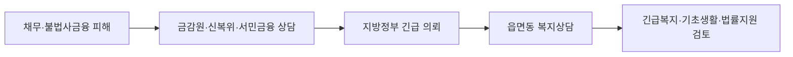

이 그림에서는 빚 자체보다 소득, 연체, 생계비 자료를 한꺼번에 정리해야 한다는 점을 봐야 한다.

**2026년 7월 10일 기준** 금융 위기가구 지원은 “신청하면 얼마를 준다”는 단일 지원금이 아니다. 빚, 불법사금융 피해, 채무조정 중단 신호를 잡아 읍·면·동 복지상담, 긴급복지, 법률지원으로 연결하는 방식이다. 보건복지부는 **2026년 7월 9일** 이 대책을 발표했다. 빚 문제도 생계가 흔들리면 복지 상담 대상이 될 수 있다.

## 누가 확인해야 하나

핵심은 채무 금액보다 생활이 이미 막혔는지다. 상담 뒤 소득·재산·가구 상황을 본다.

| 상황 | 확인할 창구 | 연결될 수 있는 지원 |
|---|---|---|
| 불법사금융 협박·고금리 피해 | 금융감독원 불법사금융 피해구제센터 | 법률지원, 지자체 복지상담 |
| 채무조정 상담 중 생계 곤란 | 신용회복위원회, 서민금융진흥원 | 읍·면·동 찾아가는 보건복지팀 의뢰 |
| 월세·공과금·식비가 밀림 | 주소지 행정복지센터 | 긴급복지, 기초생활보장 상담 |
| 혼자 신청이 어려움 | 복지위기 알림 앱, 주민센터 | 위기가구 신고와 현장 확인 |

헷갈리기 쉬운 건 “대출을 갚아주는 제도”가 아니라는 점이다. 생계 위기와 불법추심 피해를 복지·법률 상담으로 묶어 보내는 구조다.

## 2026년에 달라지는 부분

기존에는 서민금융진흥원과 신용회복위원회가 복지 지원이 필요하다고 본 사람을 지방정부에 의뢰했다. 복지부 자료 기준 **2026년 상반기** 의뢰 건수는 서민금융진흥원 약 **2만 건**, 신용회복위원회 약 **1.7만 건**이다.

새 대책은 불법사금융 피해구제센터와 대한법률구조공단을 더 붙인다. **2026년 10월부터** 금융감독원이 사회보장정보시스템을 임시 활용하고, **2027년부터** 직접 연계할 계획이다.

## 본인이 할 일

기다리기만 하면 놓칠 수 있다. 생계비가 막힌 상태라면 **주소지 행정복지센터**에 전화해서 “채무 때문에 긴급복지 상담을 받고 싶다”고 말하는 게 빠르다. 불법추심, 협박, 가족·직장 연락 피해가 있으면 금융감독원 신고도 같이 해야 한다.

- 신분증
- 최근 소득 자료나 급여 입금 내역
- 월세, 공과금, 병원비처럼 밀린 생활비 자료
- 대출·연체 문자, 불법추심 피해 자료

## 주의할 점

지원 금액은 단정하면 안 된다. 긴급복지나 기초생활보장(생활이 어려운 가구에 생계·의료 등을 지원하는 제도)은 가구원 수, 소득, 재산, 위기 사유를 따로 본다. 사설 “채무 탕감 대행”이 수수료, 휴대폰 개통, 통장 양도를 말하면 멈춰야 한다.

짧게 보면 이렇다. **2026년 7월 10일 현재** 이 대책은 정액 지원금이 아니라 위기 발굴과 연결 체계다. 빚 때문에 식비·월세·의료비가 막혔다면 채무 상담과 주민센터 복지상담을 같이 요청해야 한다. 출처는 보건복지부 **2026년 7월 9일** 보도자료와 대한민국 정책브리핑이다.
