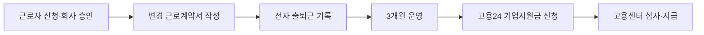

육아기 10시 출근제는 아이를 키우는 근로자가 **하루 1시간 늦게 출근하거나 일찍 퇴근**하도록 허용한 사업주에게 주는 지원금이다. 근로자 통장에 지원금이 입금되는 방식은 아니지만, 회사가 임금을 깎지 않고 제도를 운영하면 **근로자 1명당 월 30만 원, 최대 1년**을 받을 수 있다. 2026년 **7월 1일**부터는 기존의 6개월 근속 조건도 없어졌다.

## 누가 신청할 수 있나

신청자는 근로자가 아니라 **우선지원대상기업(중소기업) 또는 중견기업 사업주**다. 근로자 쪽은 아래 조건을 맞춰야 한다.

| 확인할 조건 | 2026년 7월 기준 |
|---|---|
| 자녀 나이 | **만 12세 이하** 또는 초등학교 6학년 이하 |
| 근로시간 | 매일 1시간 단축, 주 소정근로시간 **30시간 초과~35시간 이하** |
| 임금 | 단축 전보다 임금을 줄이면 안 됨 |
| 근태관리 | 전자·기계 방식으로 출퇴근 기록을 남겨야 함 |
| 운영 기간 | 최소 **1개월** |
| 연장근로 | 월 10시간을 초과하면 해당 월 지원 제외 |

고용노동부는 7월부터 근속 요건을 폐지했고, 취업규칙·단체협약 같은 근거 규정 제출도 필수에서 권고로 바꿨다. 다만 회사 내부에는 근로시간, 단축 기간, 전일제 복귀 방법을 적은 규정을 남겨두는 편이 안전하다.

그림에서 볼 부분은 지원금 수령 주체가 근로자가 아니라 제도를 도입한 사업주라는 점이다.

## 지원금은 얼마이고 언제까지 받나

지원금은 단축 근로자 1명당 **월 30만 원**이다. 근로시간 단축을 시작한 날부터 **1년 범위**에서 지급되므로, 12개월을 채우면 최대 **360만 원**이다. 사업장 전체 한도는 직전 연도 말 피보험자 수의 30% 이내이며, 최대 30명까지다. 피보험자가 10명 미만인 사업장은 최대 3명까지다.

예를 들어 8월 12일부터 제도를 시작했다면 8월분은 12일부터 말일까지 계산하고, 9월부터는 월 단위로 계산한다. 지원금은 근로자에게 지급할 임금과 별개라서 급여명세서에서 임금을 줄이는 방식으로 처리하면 안 된다.

## 고용24 신청 방법

신청은 회사가 진행한다. 단축을 시작한 달의 **다음 달부터 3개월 단위**로 신청할 수 있다.

고용24에서 기업회원으로 로그인한 뒤 고용정책 또는 기업지원금 메뉴에서 **워라밸일자리 장려금(소정근로시간 단축)**을 찾아 신청한다. 첫 번째 신청 주기는 단축을 시작한 달의 다음 달부터 **12개월 안**에 접수해야 한다. 온라인이 어렵다면 관할 고용센터 방문 신청도 가능하다.

준비할 자료는 변경 전·후 근로계약서, 월별 임금대장, 임금 지급 증빙, 전자 출퇴근 기록이다. 7월 개편으로 취업규칙 제출은 권고가 됐지만, 고용센터가 실제 운영 여부를 확인할 수 있으므로 관련 문서는 회사에 보관하는 게 좋다.

## 신청 전에 걸리는 부분

육아기 근로시간 단축 급여를 받는 법정 제도와 같은 기간에 중복해서 사용할 수 없다. 또 출퇴근 기록이 빠지거나 월 연장근로가 **10시간을 넘으면** 해당 월 장려금이 나오지 않을 수 있다. 사업주가 임금을 삭감하거나 실제로는 단축근무를 하지 않았는데 신청하면 환수와 제재 대상이 된다.

정리하면, 아이가 **만 12세 이하**이고 회사가 중소·중견기업이라면 근속기간 때문에 포기할 필요가 없어졌다. 회사와 먼저 근로시간·급여·출퇴근 기록 방식을 문서로 정한 뒤, 운영 다음 달부터 고용24에 3개월 단위로 신청하면 된다.

기준 확인일은 **2026년 7월 18일**이다. 세부 서식이나 사업장별 적용 여부는 신청 전 [고용24 고용정책 안내](https://m.work24.go.kr/cm/c/f/1100/selecSystInfo.do?currentPageNo=1&recordCountPerPage=12&systClId=SC00000307&systId=SI00000330)와 [고용노동부 7월 제도 개편 안내](https://www.moel.go.kr/news/enews/report/enewsView.do?news_seq=19598)를 함께 확인해야 한다.
