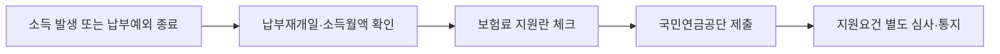

이 그림에서는 납부예외를 단순히 연장하는 것이 아니라, 소득이 생긴 뒤 납부재개와 보험료 지원을 함께 확인하는 상황을 보면 된다.

**2026년 9월 17일 기준**, 사업중단·실직·휴직 뒤 국민연금 납부를 다시 시작하는 지역가입자라면 보험료 지원을 신청할 수 있다. 다만 2026년부터는 납부예외 중이 아니어도 일정 소득 이하의 저소득 지역가입자가 대상에 포함된다. 직장가입자, 외국인, 재산·종합소득 기준을 넘는 사람에게는 이 글의 지원이 적용되지 않는다.

## 지원 대상과 금액

국민연금공단 안내상 지역가입자 지원은 연금보험료의 **50%**, 월 최대 **46,350원**, 최대 **12개월**이다. 2026년부터는 ‘납부예외 후 재개’ 요건이 확대 대상에서는 삭제됐지만, 신청 후 공단이 요건을 별도로 확인해 결과를 통지한다.

| 확인 항목 | 2026년 기준 |
|---|---|
| 가입 유형 | 국민연금 지역가입자 |
| 지원 수준 | 보험료 50%, 월 최대 46,350원 |
| 지원 기간 | 최대 12개월 |
| 재산 | 재산세 과세표준 합계 6억 원 미만 |
| 종합소득 | 사업·근로소득을 제외한 종합소득 1,680만 원 미만 |
| 기준소득월액 | 공단이 신고소득과 지원요건을 함께 확인 |

기준소득월액이 92만 7천 원이라면 보험료율 9.5% 가정 시 월 보험료는 88,065원이고, 절반 지원 후 본인 부담은 약 44,033원이다. 이는 이해를 위한 계산 예시이며 실제 고지액은 공단 결정 금액을 따른다.

## 납부재개 신고서에서 빠뜨리기 쉬운 칸

납부예외가 끝났거나 소득이 다시 발생했다면 신고서에서 `납부재개일`, `소득월액`, `재개월 납부희망 여부`를 확인한다. 재개일이 1일이 아니면 해당 월 납부희망 여부를 표시해야 한다. 지역가입자 보험료 지원도 신청하려면 같은 서식의 **지역가입자 보험료 지원 신청**란에 체크한다.

자동이체를 원할 때만 은행명·계좌번호·예금주 정보를 적는다. 본인 계좌가 아니면 예금주 주민등록번호와 가입자와의 관계까지 요구될 수 있다. 납부예외 사유를 새로 신청하는 경우에는 진단서나 휴직발령서 사본 등 증빙이 필요하지만, 단순 납부재개 신고와는 구분해야 한다.

## 반려되거나 지원이 빠졌을 때

신고가 반려됐다면 같은 서류를 반복 제출하기보다 통지서의 사유를 기준으로 세 가지를 대조한다.

- 지역가입자 자격이 맞는지, 재개일이 실제 소득 발생일과 맞는지 확인한다.
- 소득월액을 임의로 낮춰 적지 않았는지 확인한다. 공단 서식은 예외사유가 사라질 당시 업무에서 얻는 소득을 기준으로 적도록 안내한다.
- 지원 신청 누락, 재산세 과세표준, 사업·근로소득을 제외한 종합소득 기준을 다시 확인한다.

지원 신청을 했는데 보험료가 그대로라면 지원 대상 확정 전 고지일 수 있다. 신청 후 요건 확인 결과가 오지 않거나 신고 내용이 틀렸다면 국민연금공단 **1355**에 접수일과 신고 내용을 함께 문의한다. 공식 서식에는 착오 신고 시 즉시 정정신고하거나 공단에 문의하라고 적혀 있다.

신청 창구는 [국민연금공단 연금보험료 지원 안내](https://www.nps.or.kr/pnsinfo/ntpsklg/getOHAF0095M0.do)와 가까운 지사다. 납부예외·납부재개 서식은 [국민연금 사업장·지역가입자 신고서 PDF](https://m.nps.or.kr/fileDown.do?atchFileId=FL26000090&atchFileSn=1)에서 확인할 수 있다.

핵심은 **지역가입자 여부 → 재산·종합소득 경계 → 재개일·소득월액·지원란** 순서로 확인하는 것이다. 2026년부터 대상이 넓어졌어도 자동 지원은 아니므로, 납부재개 신고와 지원 신청을 함께 제출하고 결과 통지를 보관해야 한다.
